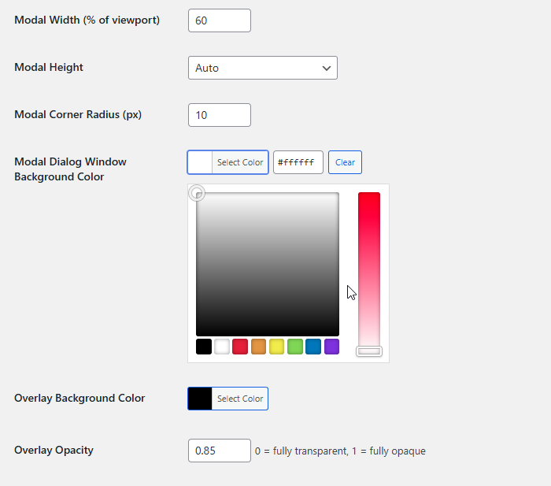
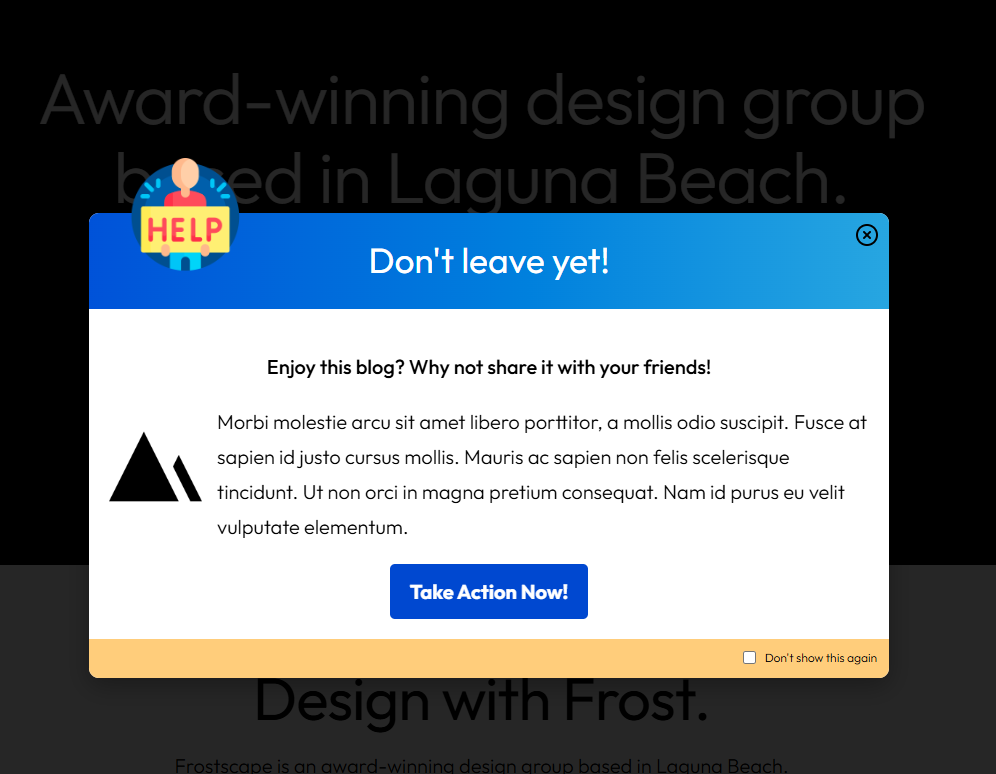
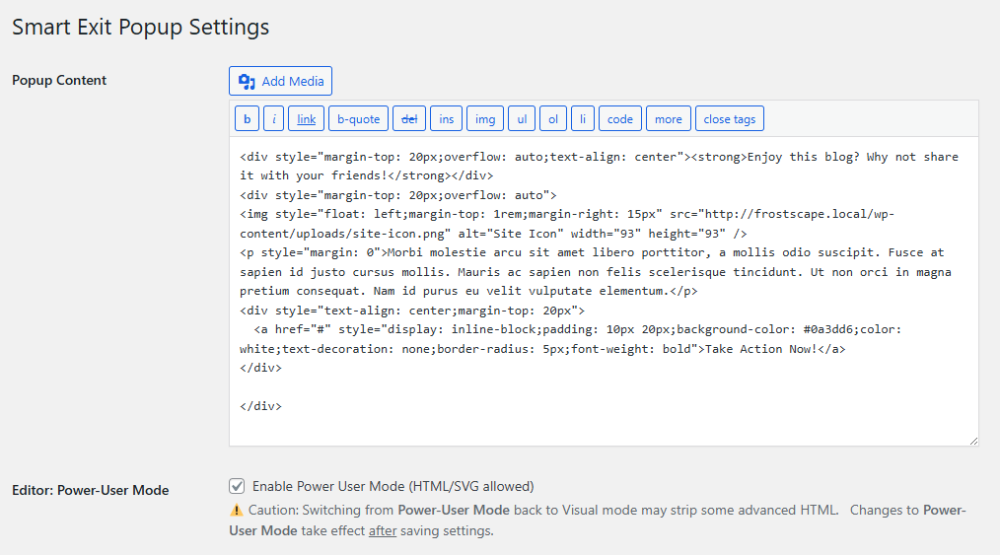
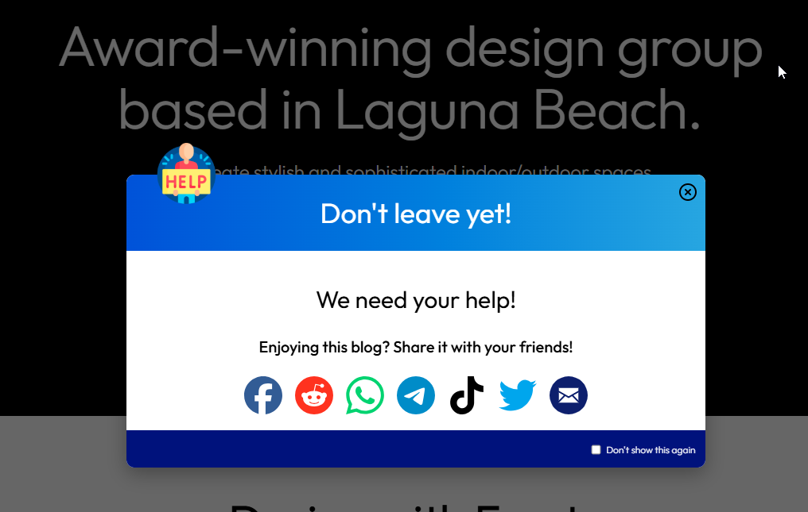
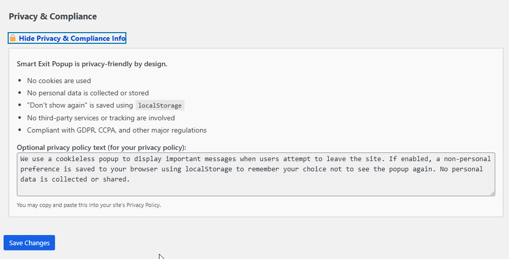

# Smart Exit Popup

**Contributors:** your-wp-username  
**Tags:** exit intent, popup, modal, engagement, overlay, conversion, lead generation, svg, localStorage  
**Requires at least:** 5.0  
**Tested up to:** 6.7.2  
**Requires PHP:** 7.2  
**Stable tag:** 1.1  
**License:** MPL version 2.0  
**License URI:** [https://www.gnu.org/licenses/gpl-2.0.html](https://www.gnu.org/licenses/gpl-2.0.html)

Display a fully customizable popup when users show intent to exit your site. Boost engagement, add messages, promote social sharing, or grow your audience.

---

## 📚 Table of Contents

- [📌 Description](#-description)
  - [🚀 Highlights](#-highlights)
  - [💡 Perfect for](#-perfect-for)
- [🛠 Installation](#-installation)
- [📷 Screenshots](#-screenshots)
- [❓ Frequently Asked Questions](#-frequently-asked-questions)
- [🔒 Privacy](#-privacy)
  - [✅ Compliance](#-compliance)
- [📝 Changelog](#-changelog)
- [📄 License](#-license)

---

## 📌 Description

**Smart Exit Popup** helps you connect with users before they leave your site. With advanced exit-intent detection, rich content support, and full visual customization, it’s the perfect lightweight engagement tool.

### 🚀 Highlights

- Detects mouse exit intent (top, sides, or bottom of screen)
- Fully customizable popup: size, color, radius, overlays, and more
- Optional **header** and **footer bars** with gradient/solid color support
- Flexible image support with positioning and scaling
- Rich content editor – add links, images, even inline SVG and social buttons
- **Power User Mode** unlocks advanced HTML (including `<svg>`, `<style>`, `<form>`, and more)
- Support for HTML `<form>`, `<input>`, `<button>`, and related tags in Power User Mode.
- Optional “Don’t show again” checkbox (saves per-browser with localStorage)
- Fully responsive and mobile-aware (disabled on touch devices)
- Cookieless by design – no external trackers, no cookies
- Built with privacy and performance in mind

### 💡 Perfect for:

- Promotions and time-sensitive offers  
- Email list growth  
- “Before you go” messages  
- Social sharing encouragement  
- Feature announcements  

---

## 🛠 Installation

1. Download the [latest release from the Releases section](https://github.com/bjazmoore/Smart-Exit-Popup/releases/tag/1.1) of the repository.
2. Unzip the plugin zip folder.
3. Upload the plugin folder to `/wp-content/plugins/` or install via the Plugins menu  
4. Activate the plugin through the “Plugins” menu in WordPress  
5. Go to **Smart Exit Popup** in the admin menu to configure settings  

---

## 📷 Screenshots

1. Admin settings panel with content editor and visual options  
    
2. Admin settings panel - popup window settings with color picker  
    
3. Example popup with header and image overlay  
    
4. Admin settings popup message editor in Power-User Mode  
    
5. Popup with social sharing icons and responsive layout  
    
6. Admin settings panel displaying privacy information  
    

---

## 📷 Example Messages

The folder [example messages](https://github.com/bjazmoore/Smart-Exit-Popup/tree/main/example%20messages) contains four examples of possible use cases for the Smart Exit Popup Plugin.  They are all rich in HTML and must be pasted into the content editor in **Power User Mode**.  Check out the README file in the folder for example screenshots.

---

## ❓ Frequently Asked Questions

### Can I customize the look and feel of the popup?

Yes! The Smart Exit Popup admin panel supports extensive customization including a formatted Header bar, Footer bar, configurable image overlay, and multiple color options. Extend the design using formatting tools in the popup message editor.

### Can I use advanced HTML or inline SVG?

Yes! Enable **Power User Mode** to safely use inline SVG, `<style>` blocks, and advanced layouts (like flexbox or grid) in your popup content. *Note:* Switching back to Visual mode may strip these advanced tags.

### Why does Visual mode strip advanced HTML?

This is a built-in WordPress behavior. The visual editor sanitizes content to prevent unsafe HTML, which can remove tags like `<svg>` or `<style>`. Power User Mode bypasses this — but switching back re-triggers the sanitization.

### Can I add social sharing buttons?

Absolutely. Use **Power User Mode** and paste your custom markup. Inline SVG icons are supported.  
See: [https://www.w3schools.com/html/html5_svg.asp](https://www.w3schools.com/html/html5_svg.asp)

### Does it work on mobile devices?

Exit intent detection is **disabled on mobile/touch devices** to avoid false triggers from swipes or scrolls.

### Will this slow down my site?

Nope! It’s ultra-lightweight — one stylesheet and one JavaScript file on the frontend, and no external dependencies.

### Can users prevent the popup from appearing again?

Yes. Enable the “Don’t show again” checkbox — the user’s choice is remembered using `localStorage`.

---

## 🔒 Privacy

Smart Exit Popup respects your users and their privacy:

- ❌ No cookies  
- ❌ No personal data collection  
- ❌ No third-party APIs or trackers  
- ✅ All preferences stored locally via `localStorage`

### ✅ Compliance

This plugin is considered compliant with:

- **GDPR** (EU)  
- **CCPA** (California)  
- **LGPD** (Brazil)  
- Other major frameworks

**Optional privacy policy blurb:**

> *We use a cookieless popup to display important messages when users attempt to leave the site. If enabled, a non-personal preference is saved in your browser using localStorage to remember your choice not to see the popup again.*

---

## 📝 Changelog

### 1.1
- Added support for HTML `<form>`, `<input>`, `<button>`, and related tags in Power User Mode.
- Added support for HTML tags for tables, lists and span also.

### 1.0

- Initial release  
- Exit-intent detection (top, left, right, bottom)  
- Customizable modal popup with header, footer, and image options  
- Full rich-text editor with power-user mode for inline HTML/CSS/SVG  
- Optional dismiss button and persistent localStorage preference  
- Responsive design with flexible layout options  

---

## 📄 License

Smart Exit Popup is free software licensed under the **Mozilla Public License v2.0**.  
See: [http://mozilla.org/MPL/2.0/](http://mozilla.org/MPL/2.0/)
